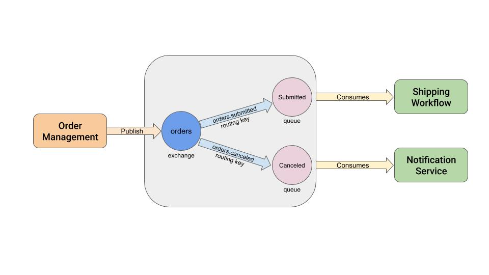

# orders example documented using AsyncAPI
In this example the collaboration between 3 different services are documented using AsyncAPI specification, in the image below we can see this collaboration.



For this example it is assumed the services are communicating through a message broker using the AMPQ protocol.

Also these specifications are making use of a WIP [Pull Request](https://github.com/asyncapi/asyncapi/pull/258/files?short_path=66aecf4#diff-66aecf47e1eec5bfb6c5192f67c0914f)

## AsyncAPI specifications

### Order Management Service
```yaml
asyncapi: '2.0.0-rc1'
id: 'urn:order-management'
info:
  title: Order Management Service
  version: '0.1.0'
channels:
  orders.submitted:
    publish:
      message:
        $ref: '#/components/messages/order'
    bindings:
      amqp:
        type: routingKey
        exchange:
          name: orders
          type: topic
        meta:
          version: '0.1.0'
  orders.canceled:
    publish:
      message:
        $ref: '#/components/messages/order'
    bindings:
      amqp:
        type: routingKey
        exchange:
          name: orders
          type: topic
        meta:
          version: '0.1.0'
components:
  messages:
    order:
      payload:
        type: object
        properties:
          id:
            type: string
          status:
            type: string
          timestamp:
            type: string

```

### Shipping Workflow Service
```yaml
asyncapi: '2.0.0-rc1'
id: 'urn:shipping-workflow'
info:
  title: Shipping Workflow Service
  version: '0.1.0'
channels:
  orders.submitted:
    subscribe:
      message:
        $ref: '#/components/messages/order'
    bindings:
      amqp:
        type: queue
        queue:
          name: submitted
        meta:
          version: '0.1.0'
components:
  messages:
    order:
      payload:
        type: object
        properties:
          id:
            type: string
          status:
            type: string
          timestamp:
            type: string

```

### Notification Service
```yaml
asyncapi: '2.0.0-rc1'
id: 'urn:notification-service'
info:
  title: Notification Service
  version: '0.1.0'
channels:
  orders.canceled:
    subscribe:
      message:
        $ref: '#/components/messages/order'
    bindings:
      amqp:
        type: queue
        queue:
          name: canceled
        meta:
          version: '0.1.0'
components:
  messages:
    order:
      payload:
        type: object
        properties:
          id:
            type: string
          status:
            type: string
          timestamp:
            type: string

```
